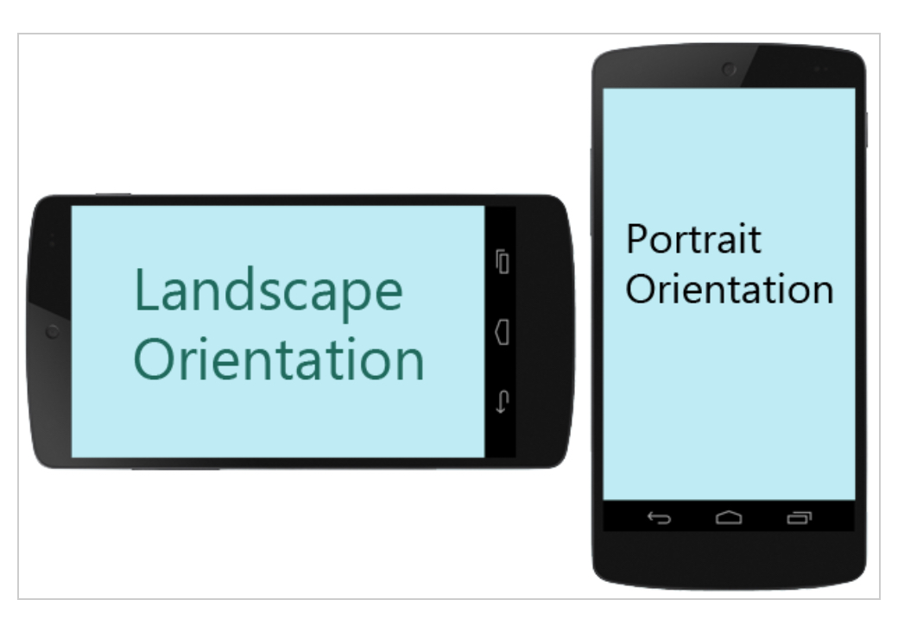

# Schülerprojekt: Drohne zum Nachbauen

## Inhaltsverzeichnis
1. [Entwicklerstatus](#Entwicklerstatus)
2. [Kontakt](#Kontakt)
3. [Dokumantation](#Dokumentation)

### Entwicklerstatus
Entwicklung gestoppt.

### Kontakt
Falls ihr Bugs oder ähnliches findet, könnt ihr ein [Issue](https://github.com/unbekanntunity/MSDrohne/issues/new/choose)

## Dokumantation

1. [Daten](#Daten)
2. [Apps](#Apps)
3. [Installation](#Installation)

### Daten
Software - App

- Sprache: Python 3.10
- Umgebung: Pycharm
- Bibliotheken:
  - Pybluez - Windows Bluetooth access
  - Kivy - GUI Framework
  - pip - Package manager
  
Hardware (ESP32-WROOM-32)
  - Sprache: Python 3.10
  - Umgebung: Thonny
  - Bibliotheken:
    - Micropython
    
### Apps

1. App für die Steuerung der Drohne
  - Einstiegtspunkt: main.py
  
2. App um über eine GUI, die Daten für das Wlan, womit sich der Microcontroller verbindet
  - Einstiegspunkt: esp32/wlan_config/main.py
  
3. Programm für den ESP32 (Microcontroller), der sich in der Drohne befindet
  - Einstiegspunkt: esp32/wlan_config/client.py
  
### Installation
Die Entwickler unter der E-Mail [Monarch Softworks](https://www.gmail.com) nach der Software fragen.
In der E-Mail sollten sich am besten schon folgende Daten über das Gerät gelistet sein.
1. Firma
2. Betriebssystem
3. Handymodell

#### oder

Unter den Verzeichnis Build, die APK herunterladen.

#### oder

Die App selber mithilfe von [buildozer](https://buildozer.readthedocs.io/en/latest/) konvertieren

Tutorial:

[(Video) Kivy crash course 2: Building an android apk](https://www.youtube.com/watch?v=t8N_8WkALdE&list=PLdNh1e1kmiPP4YApJm8ENK2yMlwF1_edq&index=2)

oder

[(Textform) http://inclem.net/2014/01/12/kivy-crash-course/2_building_an_android_apk/](http://inclem.net/2014/01/12/kivy-crash-course/2_building_an_android_apk/)


####1. Voraussetzung erfüllen
Ihr braucht Linux oder OS X um die App zu konvertieren. Falls ihr jedoch auf Windows arbeitet, könnt ihr entweder
1. eine Linux virtual machine verwenden
2. online cloud builder

Die erste Option wird empfohlen, da sie flexibler ist und robuster, da man alles lokal hat. 

Hilfe findet ihr auf folgenden Webseiten:
- [Buildozer auf einer VM installieren und ausführen](http://inclem.net/2019/05/19/kivy/running_buildozer_in_a_virtual_machine/)
- [Shared Folders](https://www.pragmaticlinux.com/2021/02/how-to-mount-a-shared-folder-in-virtualbox/#:~:text=1%20Select%20your%20virtual%20machine%20and%20open%20its,the%20OK%20button%20and%20start%20the%20virtual%20machine)
#### 1. Die Bibliothek installieren
Stellt davor sicher, dass ihr eine [virtual enviroment (venv)](https://thecodingpie.com/post/a-quick-guide-on-how-to-setup-a-python-virtual-environment-windows-linux-mac) erstellt habt und euch im richtigen Verzeichnis befindet.
```commandline
sudo pip install buildozer
```

#### 2. Main.py.
Später wird die App nach einer Datei namens Main.py suchen, die dann als Zugangspunkt verwendet wird. 
Stellt also sicher, dass sie existiert. 


#### 3. buildozer.spec erstellen
nun wird eine spec. Datei erstellt, die alle wichtigen Daten wie beispielsweise den Namen der App, Einstellungen und mehr enthält
```commandline
buildozer init
```

Öffnet sie anschließend.

```

```

- title: Titel der App
- package.name: Eine einfache ID, bestehend aus einer Zeichenkette, die zusammen mit der Kette "package.domain" einzigartig sein sollte. Sie sollte zudem keine Leerzeichen, Sonderzeichen oder ähnliches enthalten. 
- package.domain: siehe package.name 
- source.dir: Das Verzeichnis mit dem Quellcode, insbesondere mit der main.py Datei. Der Standardwert ist "." und bedeutet, dass momentane Verzeichnis.
- source.include_exts: Dateien, die mit in die konvertierte App genommen werden. Dazu zählt in allen Fällen py, kv.
- source.exclude_exts, source.exclude_dirs, source.exclude_patterns: Mehr Optionen, um auszuwählen, welche Dateien oder Dateitypen dazugenommen werden und welche nicht.
- version.regex, version.filename: Sucht in der angegebenen Datei (normalerweise, main.py) nach einer Zeichenkette ``__version__ = 'some_version'``. Falls, dass nicht geschehen ist, kommentiert diese Zeile aus.
- version: Der andere Weg die Version anzugeben. Verwendet sie, wenn uhr den oberen Weg nicht gegangen seid.
- requirements: Eine mit Kommas abgetrennte Liste, die Namen von Bibliotheken enthalten, die nicht zu den Standard Bibliotheken gehören.
- presplash.filename: Dateiname des Bildes, welches beim Ladebildschirm erscheint, wenn die App zum ersten Mal gestartet wird.
- icon.filename: Dateiname des Icons (Bilddatei)
- orientation: Kann entweder ``landscape``, ``potrait`` oder ``all``sein. Das kann man auch dynamisch in der App ändern.

- fullscreen: Die App soll entweder den ganzen Bildschirm füllen (1) oder nicht (0).
- log_level: Anzahl der Informationen, die ausgegeben werden.

- Android & IOS spezifische Optionen: Sind für uns nicht relevant, da die Standardwerte ausreichen.

#### 4. App bauen
Führt den folgenden Befehl aus:
```commandline
buildozer android debug
```

- debug: Entscheidet über die Art und Weise, wie die App signiert wird.
Normalerweise würde man es mit einem Entwicklerschlüssel tun, aber das ist für Testzwecke nicht nötig.

Beim ersten Mal wird dieser Prozess etwas Zeit in Anspruch nehmen, da die Bibliotheken(e.g Android SDK, NDK und andere Tools) heruntergeladen müssen.
Bei den nächsten Malen wird, es nicht mehr so lange dauern, da die Bibliotheken nur noch geprüft und dann direkt verwendet werden können.

Falls ihr das Gerät schon an eurem Computer angeschlossen habt, könnt ihr hiermit die App direkt auf euer Handy laden.
```commandline
buildozer android debug deploy
```

Letztes Update: 23/12/2021

